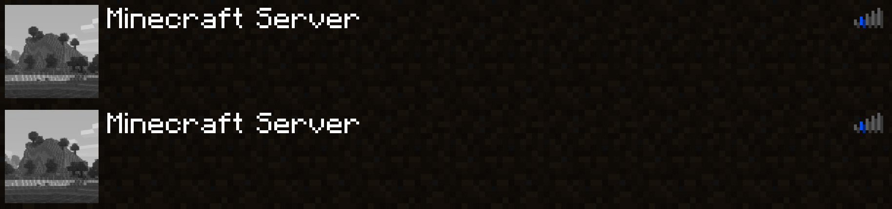

## fast-ip-ping

[](http://www.gnu.org/licenses/lgpl-3.0.html)
[](https://github.com/Fallen-Breath/fast-ip-ping/actions/workflows/gradle.yml)
[](https://legacy.curseforge.com/minecraft/mc-mods/fast-ip-ping)
[](https://legacy.curseforge.com/minecraft/mc-mods/fast-ip-ping)
[](https://modrinth.com/mod/fast-ip-ping)



Yeet the laggy reversed DNS lookup for pure IP server addresses

Extracted from the `yeetServerIpReversedDnsLookup` option in [TweakerMore](https://github.com/Fallen-Breath/tweakermore) Mod

### What & Why & How

For servers whose addresses are represented solely by IP, e.g. `192.168.2.10:25565`, disable reverse DNS lookups in the corresponding `InetAddress` object

Many non-loopback IPs lack associated domain names, which makes reverse lookups time-consuming

```java
// java.net.InetAddress.getHostName(boolean)
String getHostName(boolean check) {
    if (holder().getHostName() == null) {  // It will be null if InetAddress.getByName() received a pure IP 
        holder().hostName = InetAddress.getHostFromNameService(this, check);  // <-- takes forever
    }
    return holder().getHostName();
}
```

This option sets the domain of those servers directly to their IP, bypassing the reverse DNS check

This results in a 1s ~ 5s reduction in time for servers with pure IP address. Affects the following environments:

- Pinging the server in the server list screen 
- Connecting to the server

### Environment

- Client-side only
- Fabric / Forge mod loader. No extra requirement is needed
